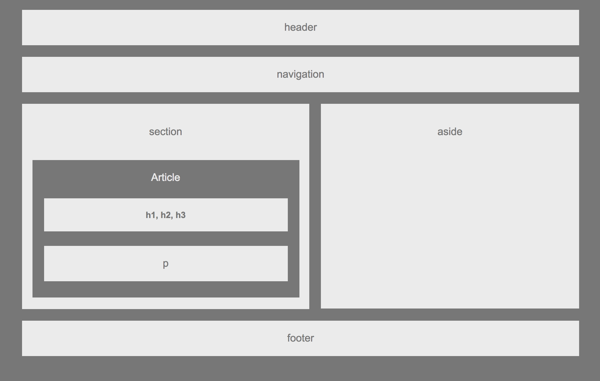

# Wireframe Project

Learning how to use HTML & CSS - mainly learning how floats work.

[Live Website](https://acekreations.github.io/HW-Wireframe/)

## Technology Used
- HTML
- CSS

## Learning Points
- I learned how floats change the flow of css
- I learned how margins and padding change the overall width of an object and can significantly effect your layout.

## Author
Craig Melville
